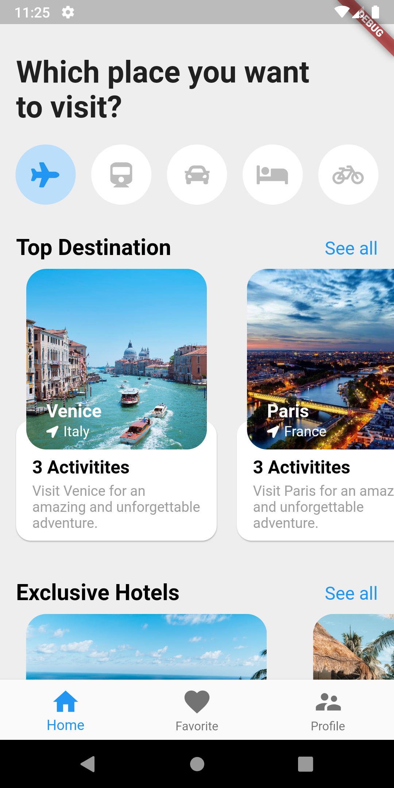
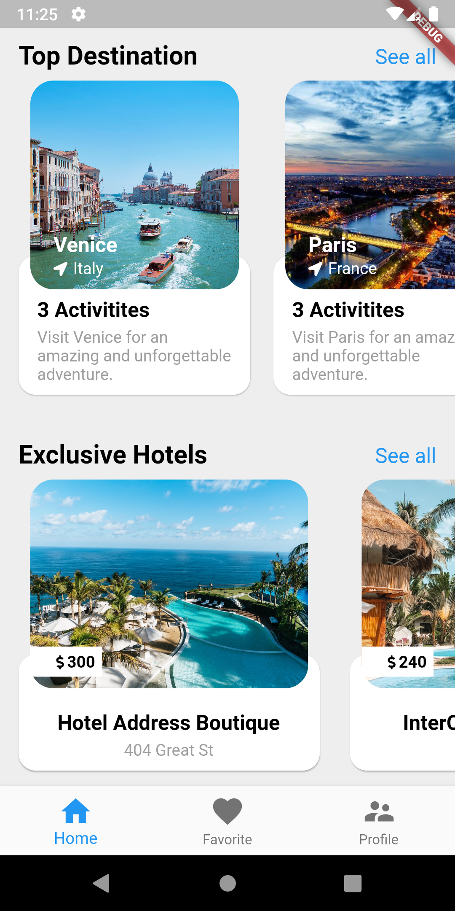

# Travel app

A new travel application made in flutter.
App will demonstrates uses of different widgets like Scaffold, Material, Container, 
Position, Hero, Row, Column, ListView and Lots more...

App demonstrates, how to design beautiful UI in flutter using Widgets like a pro developer.

It also include -
  how to do Animation(Shared element transaction), 
  how to design bottom navigation,
  how to handle widget states and 
  how to navigation between pages.
 

## App Screenshot

  
  
  

## If you want to learn more

A few resources to get you started if this is your first Flutter project:

- [Lab: Write your first Flutter app](https://flutter.dev/docs/get-started/codelab)
- [Cookbook: Useful Flutter samples](https://flutter.dev/docs/cookbook)

For help getting started with Flutter, guidance on mobile development, and a full API reference. 
View official documentation
[online documentation](https://flutter.dev/docs)
